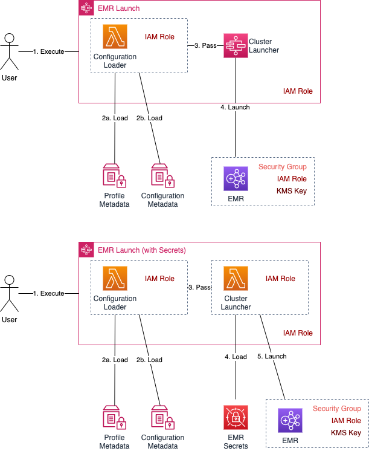

# AWS EMR Launch Usage

## Intro
AWS EMR Launch provides Step Functions preconfigured to launch EMR Clusters with predefined Profiles (IAM Roles, Instance Profiles, KMS Keys, Security Groups) and Configurations (Node Types/Counts, Configuration Files, EMR Versions, etc). Each Step Function is configured to load specific Profile and Configuration Metadata, ensuring that Users authorized to execute the Step Function are restrited to this Cluster Definition. 

Two types of EMR Launch are supported: with and without Secrets. Secrets are configuration parameters like database/metastore credentials, Kerberos parameters, etc. Rather than storing the Secrets in Step Function definition, these are kept in Secrets Manager and loaded dynamically when the Cluster is launched.

## Launching a Cluster (without Secrets)
1. The EMR Launch Step Function is executed. The IAM User/Role must be authorized the execute the Step Function
2. The Step Function utilizes a Lambda Function to load Profile and Configuration Metadata from the Parameter Store
   - This is a dedicated Lambda Function with an Execution Role granted access to only these specific Parameter Store values
   - The Step Function Execution Role is granted execute on only this specific Lambda Function
3. Metadata is combined and passed to a Step Function EMR Integration Task
4. The EMR Integration Task launches the EMR Cluster
   - The Step Function Execution Role is granted PassRole to only the specific IAM Role/Instance Profile defined in the Profile Metadata

## Launching a Cluster (with Secrets)
1. The EMR Launch Step Function is executed. The IAM User/Role must be authorized the execute the Step Function
2. The Step Function utilizes a Lambda Function to load Profile and Configuration Metadata from the Parameter Store
   - This is a dedicated Lambda Function with an Execution Role granted access to only these specific Parameter Store values
   - The Step Function Execution Role is granted execute on only this specific Lambda Function
3. Metadata is combined and passed to a Cluster Launcher Lambda Function
4. The Cluster Launcher Lambda Function loads Secrets from the Secrets Manager, combines them with the Cluster Definition. 
   - This is a dedicated Lambda Function with an Execution Role granted access to the Secrets. 
5. The Cluster Launcher Lambda Function launches the EMR Cluster
   - The Lambda Execution Role is granted PassRole to only the specific IAM Role/Instance Profile defined in the Profile Metadata

## Potential Threats
1. Users/Roles can create clusters with Profiles/Configurations they are not authorized for
2. Modifying Profile metadata could allow Users to create clusters with alternate IAM Roles/Instance Profiles